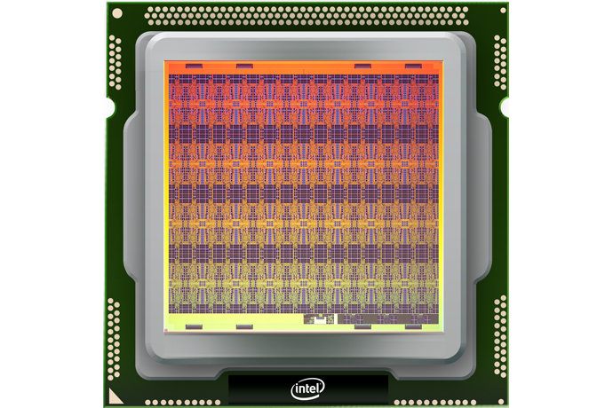
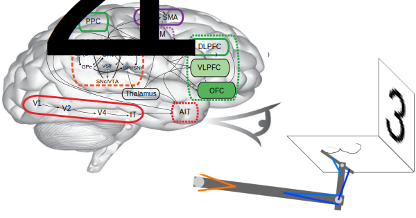

:orphan:

********
Overview
********

  Nengo is the leading multi-platform neuromorphic compiler and
  development environment.

Nengo is a graphical and scripting based Python package
for simulating large-scale neural networks.
Nengo can create sophisticated
spiking or non-spiking neural simulations
with sensible defaults in a few lines of code.

.. figure:: http://appliedbrainresearch.com/img/gui-03.gif
   :width: 100%
   :alt: NengoGUI
   :align: center

   The Nengo GUI is a live coding, fully interactive environment.

   Intel's new Loihi chip is among the many kinds of hardware supported by Nengo.

Nengo is built to help solve problems with the most efficient hardware
available for that problem.

  Nengo is highly extensible and flexible.

You can define your own neuron types, learning rules,
optimization methods, reusable subnetworks, and much more.
You can also get input directly from hardware,
build and run deep neural networks,
drive robots,
and even implement your model on
a completely different neural simulator
or neuromorphic hardware.

  Nengo is a powerful development environment at every scale

Among other things,
Nengo is used to implement networks for
deep learning, vision, motor control,
visual attention, serial recall, action selection,
working memory, attractor dynamics, inductive reasoning,
path integration, and planning with problem solving.  Nengo has
libraries specifically designed to help with cognitive modelling,
deep learning, adaptive control, and accurate dynamics, to name a few.

   Spaun, the world's largest functional brain model, was built in Nengo.
