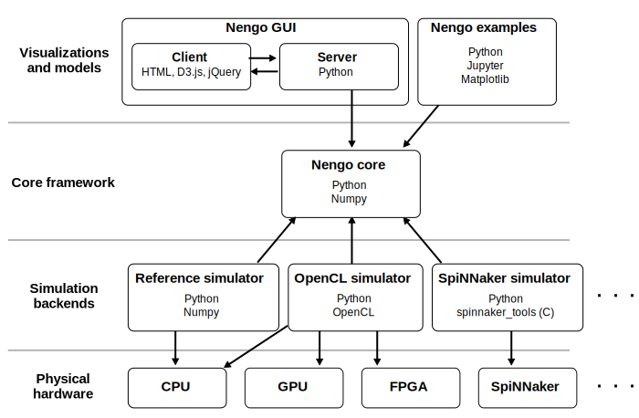

:orphan:

***************
Nengo ecosystem
***************

.. default-role:: obj

The Nengo ecosystem is made up of
several interacting projects.
The following image shows how these projects interact.
Each arrow indicates a dependency on another project
(e.g., the Nengo GUI depends on Nengo core).

The Nengo ecosystem is organized this way so that
visualizations and models only need to know about
the Nengo core in order to be run on many different types
of physical hardware.
Most models can be run on a CPU, GPU, FPGA,
and neuromorphic hardware.

Core framework
==============

.. project:: Nengo core
   :repo: nengo/nengo
   :maintainer: Trevor Bekolay
   :contact: tbekolay@gmail.com
   :pypi: nengo
   :docs: https://www.nengo.ai/nengo/

   The core of the Nengo ecosystem is the
   Python library ``nengo``,
   which includes the five Nengo objects
   (`~nengo.Ensemble`, `~nengo.Node`, `~nengo.Connection`,
   `~nengo.Probe`, `~nengo.Network`)
   and a NumPy-based simulator.

.. project:: Nengo Library
   :repo: arvoelke/nengolib
   :maintainer: Aaron Voelker
   :contact: arvoelke@gmail.com
   :docs: https://arvoelke.github.io/nengolib-docs/

   Additional extensions for large-scale brain modelling with Nengo.
   Includes advanced dynamics networks,
   additional synapse models, and more.

.. project:: Nengo extras
   :repo: nengo/nengo-extras
   :maintainer: Trevor Bekolay
   :contact: tbekolay@gmail.com
   :pypi: nengo-extras
   :docs: https://www.nengo.ai/nengo-extras/

   Nengo extras contains extra utilities and add-ons for Nengo.
   These utilities are helpful when you need them,
   but they're not necessary for using Nengo,
   so we keep them separate to keep the Nengo core
   as small as possible.

.. project:: Nengo documentation
   :repo: nengo/nengo.github.io
   :maintainer: Trevor Bekolay
   :contact: tbekolay@gmail.com
   :docs: https://www.nengo.ai/README.html

   You're reading the Nengo documentation right now!
   It contains general information about
   projects in the Nengo ecosystem
   and how these projects are developed.

.. project:: Enhancement proposals
   :repo: nengo/enhancement-proposals
   :maintainer: Trevor Bekolay
   :contact: tbekolay@gmail.com
   :docs: https://www.nengo.ai/enhancement-proposals/

   Nengo Enhancement Proposals (NEPs) are proposals
   that touch multiple projects in the Nengo ecosystem,
   or represent a large change to one important project.

Visualizations and models
=========================

.. project:: Nengo GUI
   :repo: nengo/nengo-gui
   :maintainer: Terry Stewart
   :contact: terry.stewart@gmail.com
   :pypi: nengo-gui

   Nengo GUI is a web browser-based interactive
   model construction and visualization tool.

.. project:: Nengo SPA
   :repo: nengo/nengo-spa
   :maintainer: Jan Gosmann
   :contact: jan@hyper-world.de
   :pypi: nengo-spa
   :docs: https://www.nengo.ai/nengo-spa/

   The Semantic Pointer Architecture (SPA)
   uses Nengo to build large cognitive models.

.. project:: Nengo examples
   :repo: nengo/nengo-examples
   :maintainer: Trevor Bekolay
   :contact: tbekolay@gmail.com

   An archive of Nengo examples.
   We've found that examples are the best way
   to learn about Nengo,
   so we curate a large collection of examples here
   for teaching purposes.

Simulation backends
===================

Models created with the Nengo core
can be run on any backend.
Each backend is designed for a particular use case,
like a particular hardware or software platform,
allowing the same model to be run
faster or more accurately.

.. project:: Nengo OpenCL
   :repo: nengo/nengo-ocl
   :maintainer: Eric Hunsberger
   :contact: erichuns@gmail.com
   :pypi: nengo-ocl

   Nengo OpenCL uses the `OpenCL framework <https://www.khronos.org/opencl/>`_
   to run Nengo models on GPUs and other platforms.
   Most models run significantly faster with Nengo OpenCL.

.. project:: Nengo DL
   :repo: nengo/nengo-dl
   :maintainer: Daniel Rasmussen
   :contact: dhrsmss@gmail.com
   :pypi: nengo-dl
   :docs: https://www.nengo.ai/nengo-dl/

   Nengo DL simulates Nengo models using
   the `TensorFlow <https://www.tensorflow.org/>`_ library
   to easily interact with deep learning networks,
   as well as use deep learning training procedures
   to optimize Nengo model parameters.

.. project:: Nengo Loihi
   :repo: nengo/nengo-loihi
   :maintainer: Trevor Bekolay
   :contact: tbekolay@gmail.com
   :pypi: nengo-loihi
   :docs: https://www.nengo.ai/nengo-loihi/

   Nengo Loihi runs Nengo models on
   Intel's Loihi neuromorphic hardware.
   Nengo Loihi also includes a software simulation
   of Loihi's spiking neuron cores so that
   models can be prototyped before running on real hardware.

.. project:: Nengo SpiNNaker
   :repo: project-rig/nengo_spinnaker
   :maintainer: Andrew Mundy
   :contact: andrew.mundy@ieee.org
   :pypi: nengo_spinnaker

   Nengo SpiNNaker simulates Nengo models using
   `SpiNNaker <http://apt.cs.manchester.ac.uk/projects/SpiNNaker/>`_
   architecture and associated hardware.
   Models running on SpiNNaker always execute in real time.

.. project:: Nengo MPI
   :repo: nengo/nengo-mpi
   :maintainer: Eric Crawford
   :contact: eric.crawford@mail.mcgill.ca

   Nengo MPI simulates Nengo models using a
   C++ backend that uses `MPI <https://www.open-mpi.org/>`_
   to parallelize the running of the model
   on large numbers of heterogeneous processing units.
